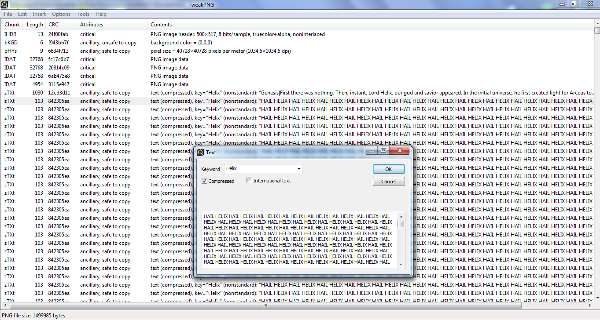
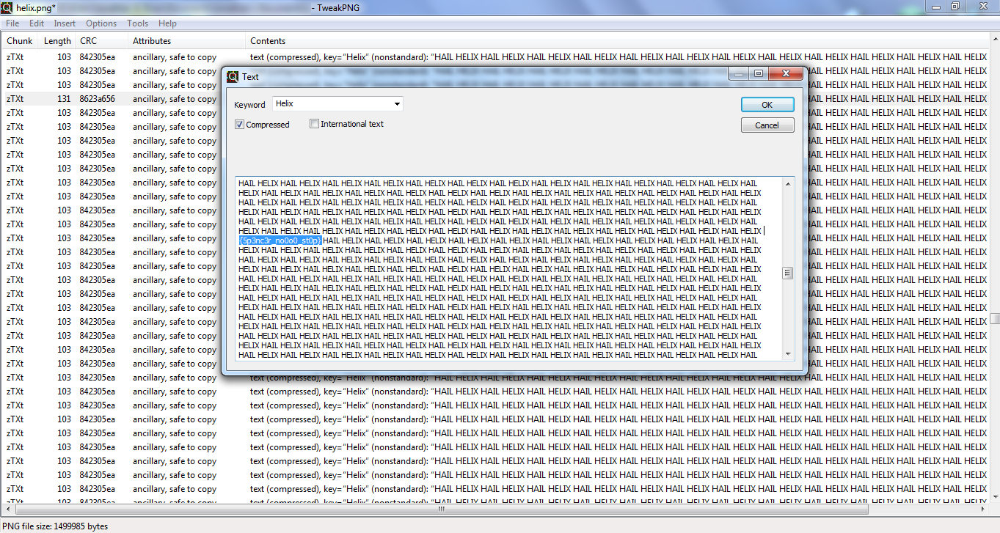

# CAMS CTF 2015

### Problem

**Points**: 20

**Description**: 

> Hmmm, I wonder who Lord Helix is and what he wants with you.  
> helix.png

**Hint**: 

> Hint: TweakPNG may not be your friend sometimes.

### Solution

**Note**: This was not a particularly elegant solution.

First, we dumped all of the strings into a file, just to see if there was anything interesting.

```
[!] strings helix.png > helix.txt
```

Next, we looked through the strings, seeing a lot of this: 

```
gzTXtHelix
UUUUUUUUUUUUUUUUUUUUUUUUUUUUUUUUUUUUUUUUUUUUUUUUUUUUUUUUU
```

However, there was an anomaly towards the middle of the file. This will be important later on.

The hint mentioned TweakPNG, so why not give that a shot?



Now, we can see that the file is filled with encoded chunks that are all filled with `HAIL HELIX`. The anomaly was probably the flag encoded, so we searched the middlemost chunks, looking for a chunk with a length different from those of the others. After some painstaking staring and scrolling, we found the anomalous chunk with the flag in it.



**Flag**: `{5p3nc3r_no0o0_st0p}`

### Other Resources

* None.
