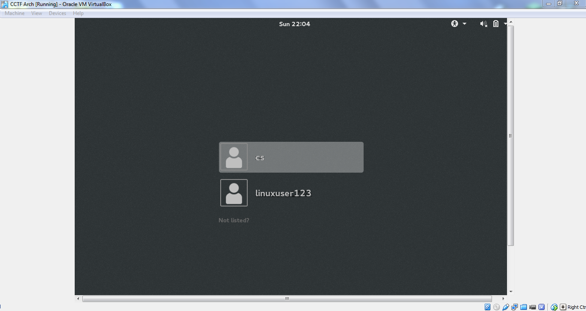
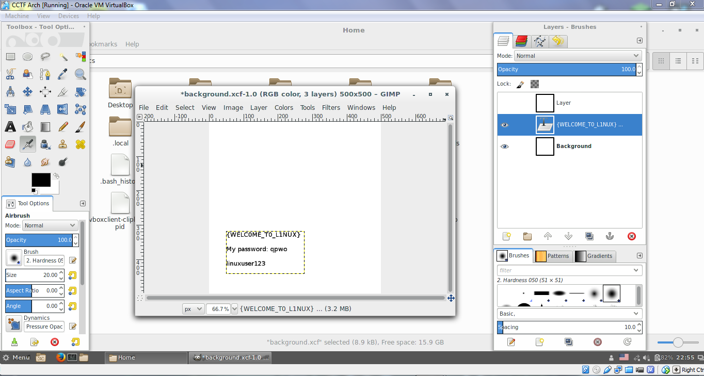

# CAMS CTF 2015: Linux 2

### Problem

**Points**: 35

**Description**: 

> Open the virtual machine.

**Hint**: 

None given.

### Solution

Once you have VirtualBox, you can open the image by going to the toolbar, and then `Machine` and `Add`. A file dialog should pop up; navigate to where you extracted the image, and add `CCTF Arch.vbox`. Next, click the `Start` button with the green arrow, and you should be good to go. If all goes well (sometimes it does not, in which case you should either try again or troubleshoot with the help of Google), Arch Linux will automatically boot itself and present you with a login panel that should look like this: 


Log in as `cs` using the provided credentials. On the desktop are a file called `background.txt` and a directory called `2`. Inside `2` are a bunch of numbered files containing random numbers (not much help), but in `background.txt` is a message: 

```
I remember linuxuser123 telling me that he hid some important stuff in my background. 

If only there was a free, open-source imaging editing program for linux that would let me take a look around...
```

If you look in your home directory, you will see a file named `background.xcf`, which is notable because the XCF file format is native to [GIMP](http://www.gimp.org/), the GNU Image Manipulation Program.

When you initially open the file in GIMP, the image appears to be blank. However, XCF is also designed to store individual layers, and these can be disabled in the layers panel. The message hidden underneath gives you the flag as well as `linuxuser123`'s password.



**Flag**: `{WELC0ME_T0_L1NUX}`

### Other Resources

* None.
