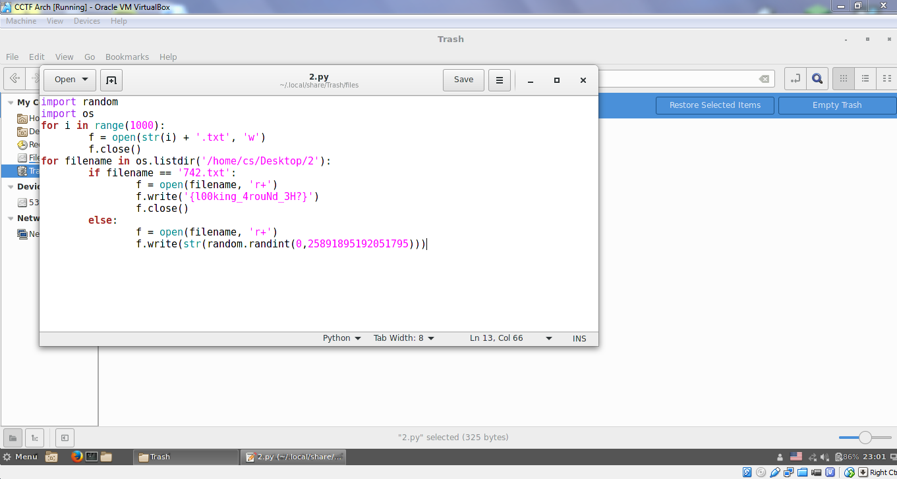

# CAMS CTF 2015: Linux 3

### Problem

**Points**: 30

**Description**: The documents enclosed may be of significance.

**Hint**: 

None given.

### Solution

Based on the description, we probably need to go back and investigate the files in the `2` directory on the desktop and how they were generated. When we looked in the trash, we found this program, with the flag in plain sight: 

**Flag**: `{l00king_4rouNd_3H?}`

### Other Resources

* None.
