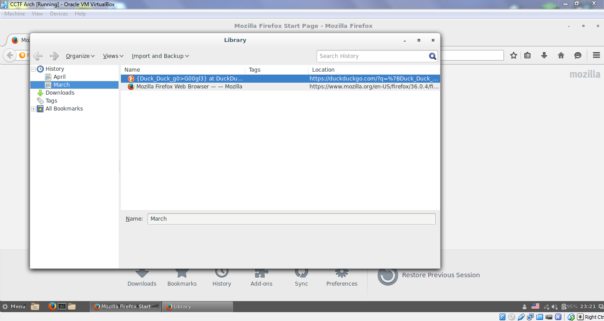

# CAMS CTF 2015: Linux 4

### Problem

**Points**: 25

**Description**: 

> Explore the installed programs.

**Hint**: 

None given.

### Solution

The image that you are given doesn't have that many programs on it. However, it does have [Firefox](https://www.mozilla.org/en-US/firefox/new/), which has enough complexity to possibly contain a flag. Sure enough, the flag is in the history: 

**Flag**: `{Duck_Duck_g0>G00gl3}`

### Other Resources

* None.
