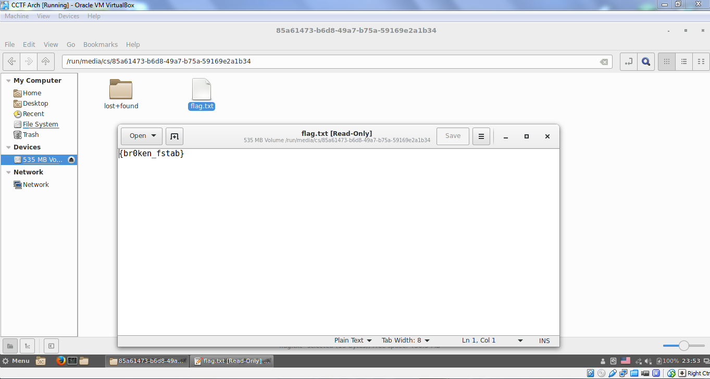

# CAMS CTF 2015: Linux 5

### Problem

**Points**: 100

**Description**: 

> Seems /dev/sda4 is not being mounted on startup...

**Hint**: 

None given.

### Solution

According to the file manager, `/dev/sda4` is a 535 MB volume. We can mount the partition and view the flag: 

**Flag**: `{br0ken_fstab}`

### Other Resources

* None.
