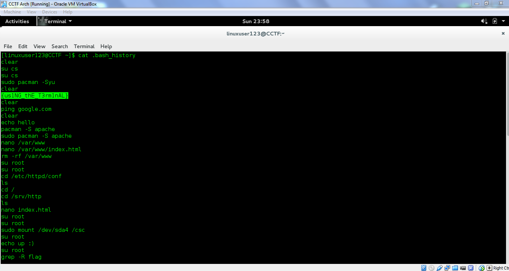

# CAMS CTF 2015: Linux 6

### Problem

**Points**: 50

**Description**: 

> Which program is the most useful?

**Hint**: 

None given.

### Solution

After reading some other writeups, the intended solution was to use `grep`, a command that allows you to search files using regexes. However, one of the first files we searched as `linuxuser123` was `.bash_history`, which happened to already contain the flag.

**Flag**: `{us1NG_thE_T3rm1nAL}`

### Other Resources

* None.
