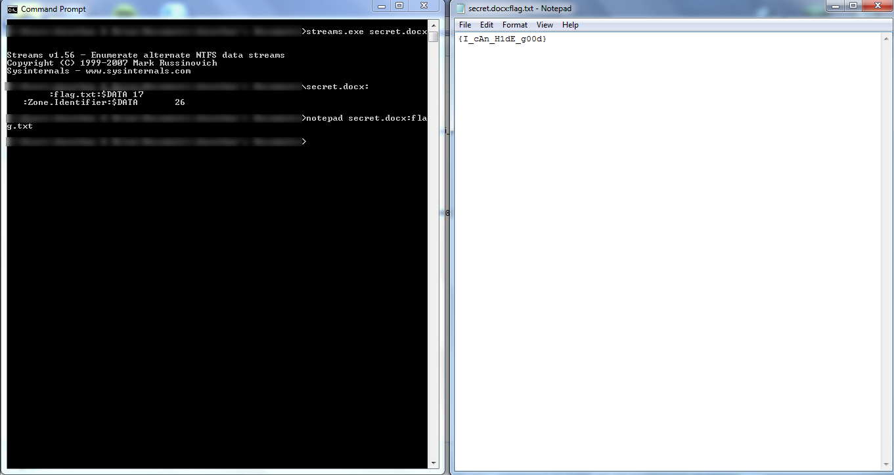

# CAMS CTF 2015: Streaming 1

### Problem

**Points**: 75

**Description**: 

> Don't worry, it will extract if you wait long enough. Also, use winRAR.  
> secret.rar

**Hint**: 

> 2015-04-19 > By Streaming, we mean Alternate Data Streams.

### Solution

Alternate Data Streams (ADS) are a relatively obscure feature of NTFS filesystems that allow files to have multiple forks, or multiple sets of data. Some of these alternate forks can contain data such as metadata and thumbnails. Because data hidden in other forks do not count towards the size of a file and do not show up in the file browser, ADS represent a significant security vulnerability. RAR files are one of the few compressed formats that still support ADS.

Once you extract the word file in `secret.rar`, you can use [this utility](https://technet.microsoft.com/en-us/sysinternals/bb897440) to view the alternate data streams of `secret.docx`. The utility will reveal that there is a hidden `flag.txt` that can be read using Notepad.

**Flag**: `{I_cAn_H1dE_g00d}`

### Other Resources

* None.
