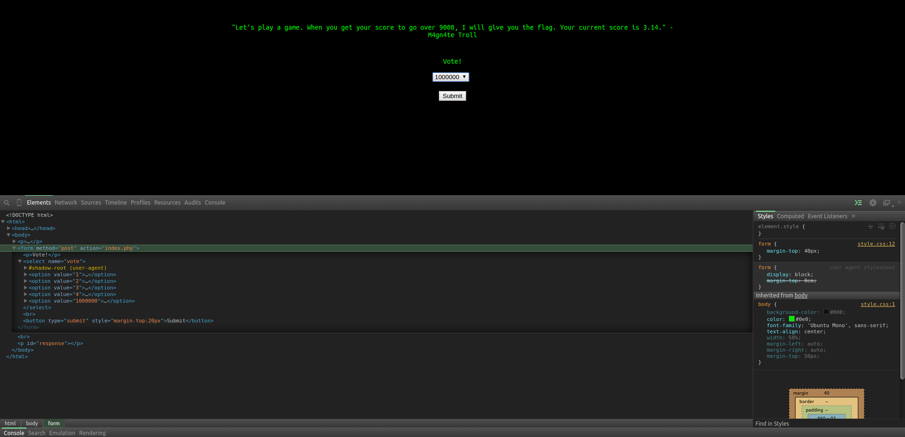

# CAMS CTF 2015: Web 3

### Problem

**Points**: 40

**Description**: 

> This game is extremely fun.  
> Web 3

**Hint**: 

None given.

### Solution

When you access the page, you are invited to choose one of four numbers. Your goal is to obtain a score over 9000. Selecting any of the four numbers will not give you a high enough score.

One thing to be aware of is that end users are not necessarily restricted by the options that the form gives. As such, we can edit the HTML (in Chrome, the developer's panel can be opened using <kbd>CTRL</kbd>+<kbd>SHIFT</kbd>+<kbd>J</kbd>) and add an option in the form for a very large number to get us over 9000.

As expected, we are given the flag.

**Flag**: `{i_increased_integers?}`

### Other Resources

* None.
