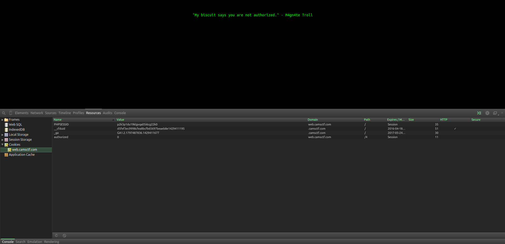

# CAMS CTF 2015: Web 4

### Problem

**Points**: 50

**Description**: 

> If only the cookie monster was here to see this.  
> Web 4

**Hint**: 

None given.

### Solution

Cookies are bits of data that a web application stores on the client side. These are useful for holding session IDs, for example, telling the server that the user is already logged in as a certain user. However, they can be viewed and modified by the client, which is why they should never hold passwords or other critical data.

In this challenge, the troll has made that mistake, allowing the user to control authorization. Here are the cookies listed in the developer's console: 



To gain authorization, we merely have to set the `authorized` field to `1` (i.e. true). Here is the JavaScript code to do that (to be run in the JavaScript console): 

```javascript
document.cookie = 'authorized=1';
document.location.reload();
```

**Flag**: `{C0O0KIEEEEEE!}`

### Other Resources

* None.
